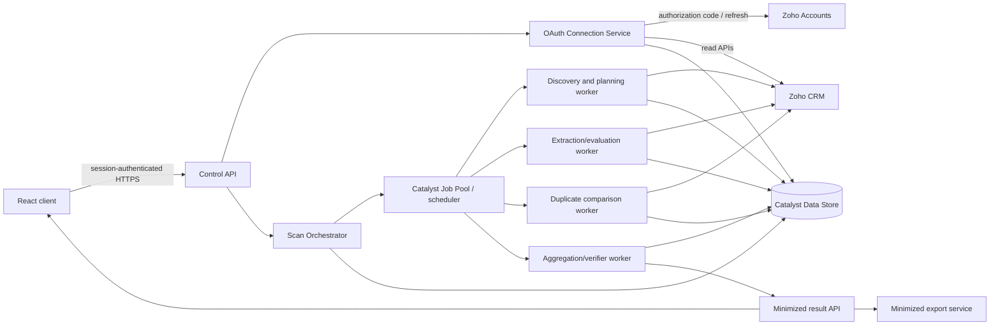

# Zoho CRM Data Health Scanner — Catalyst Architecture

**Status:** Remediated architecture proposal; no production implementation authorization is implied  
**Authoritative product input:** `approved-product-contract.md`  
**Scope:** Catalyst-hosted React + Python migration for Zoho CRM v1  
**Date:** 17 August 2026

This revision responds to `catalyst-architecture-compliance.md`. The compliance report is a review aid, not product authority. If this document differs from `approved-product-contract.md`, the contract controls.

## 1. Decision boundary

This document uses the following labels deliberately:

- **APPROVED PRODUCT DECISION** — behavior explicitly approved in `approved-product-contract.md`.
- **IMPLEMENTATION DECISION** — engineering design proposed here to satisfy an approved product decision. It is not a product approval and may change after a technical spike without changing product behavior.
- **TECHNICAL VERIFICATION GATE** — engineering evidence that may be gathered without choosing product behavior. Passing a gate demonstrates feasibility or runtime behavior; it does not approve a product decision.
- **PRODUCT APPROVAL GATE** — a product/privacy decision that engineering may not resolve through a spike or implementation preference.
- **UNRESOLVED PRODUCT DECISION** — an area that this architecture does not decide.

The following product decisions are authoritative for this architecture:

| ID | Approved requirement used here |
|---|---|
| D2 | Severity-weighted domain scores; applicable/measurable domain-weight normalization |
| D4 | User score is percent proper and is gated by the minimum-record floor |
| D5 | Within-module duplicate matching, exact-match shortcuts only, deterministic handling of blocks over 40, documented name-prefix blocking |
| D7 | Rich data may exist only in the active session; exports and Catalyst persistence are minimized |
| D13 | Durable batches, persisted batch results, checkpoint/resume and auditable completeness |
| D14-POLICY | Explicit administrator-authorized, organization-specific CRM connection |
| D14-EVIDENCE | Verification plan is defined but full visibility is not technically proven |
| TZ-1 | CRM organization timezone and genuine close/audit timestamps govern time-based rules |

The following remain unresolved and are outside this architecture's authority:

| ID | Status and architectural treatment |
|---|---|
| D8 | **UNRESOLVED PRODUCT DECISION.** No editable/read-only threshold UI is selected. The backend accepts a versioned rule configuration but the UI must not expose configurability until D8 is approved. |
| D9 | **UNRESOLVED PRODUCT DECISION.** No promise is made about setup cost/runtime accuracy. The job system records actual usage; setup estimation behavior is not designed here. |
| D10 | **UNRESOLVED PRODUCT DECISION.** Screen gaps are not silently added to the React scope. Backend APIs are capability-oriented and do not imply approval of any missing screen behavior. |
| D12 | **UNRESOLVED PRODUCT DECISION.** Configuration Hygiene has no production evaluator or slice behavior in this design. D2 must be revalidated when D12 is decided. |
| D15-KNOB | **UNRESOLVED PRODUCT DECISION.** `maxExamplesPerRule` is neither implemented nor removed here. No architecture limit is presented as that product knob. |

Retention duration, deletion trigger and audit-log retention duration are also not specified by D7. This architecture exposes the required control points but does not invent durations.

## 2. Architectural principles

1. The browser is a control and presentation surface, never the owner of OAuth tokens, extraction state or authoritative scan results.
2. Every scan is an immutable, versioned job definition. A changed scope or rule version creates a new scan.
3. Source data is evaluated in transient worker memory only if D7's server-session interpretation is approved. Catalyst may persist only the literal D7 tuple until any additional operational metadata is explicitly approved.
4. No final result is calculated or published until all required persisted batches pass completion verification. Publication of an overall score is additionally blocked until D12 is resolved and D2 is revalidated.
5. Retried work is idempotent. A worker may execute more than once, but a logical batch result is committed once.
6. Tenant identity (`connection_id`/CRM `org_id`) is included in every authorization check, storage key and job message.
7. Extraction completeness and CRM visibility assurance are separate claims. A complete extraction of a visibility-limited identity is not an org-wide scan.
8. Product-approved formulas and policies are versioned independently from engineering implementations.

## 3. Logical architecture



Catalyst Data Store is the proposed relational control plane because scan, batch, lease and result records have fixed relationships and need transactional/idempotent updates. Catalyst documents relational storage, table permissions, ZCQL and background bulk insertion support. Catalyst Job Scheduling is the proposed execution trigger for resumable workers. These are **IMPLEMENTATION DECISIONS**, not product requirements.

Stratus must not be used to persist CRM Bulk Read ZIP/CSV payloads under the current D7 decision. A Bulk Read download is streamed or held only in verified ephemeral worker storage, evaluated, and destroyed before the worker acknowledges completion. If Catalyst's runtime cannot guarantee that temporary storage is non-persistent and securely cleared, streaming is mandatory.

## 4. Security and trust boundaries

### 4.1 Browser boundary

The React client may receive:

- connection status and visibility-assurance status;
- job state, progress, counts and non-sensitive error codes;
- final scores and minimized findings;
- rich names/labels only when fetched for the active session and held only in browser memory, consistent with D7.

The React client must never receive or store:

- OAuth client secrets, authorization codes after exchange, access tokens or refresh tokens;
- raw Bulk Read/COQL payloads;
- persisted normalized emails, phones, statutory identifiers or duplicate blocking keys;
- source field values embedded in persisted/exported reason text.

### 4.2 Control API boundary

All connection, scan and export endpoints require Catalyst application authentication plus an application role. Connection creation/revocation requires the customer-organization administrator role in this application. Possessing an application role does not prove the user is a Zoho CRM administrator; CRM administrator verification is a separate OAuth postcondition described in Section 5.

Every request resolves the caller's allowed `tenant_id` server-side. Client-supplied tenant, connection, scan and batch IDs are never trusted without a tenant ownership check.

### 4.3 Worker boundary

Workers are not directly callable from the public client. Job payloads contain opaque internal IDs, not tokens or CRM records. Workers obtain an access token server-side for a specific connection and use only the versioned read-scope manifest associated with that connection.

### 4.4 Storage boundary

Data Store tables are server-only unless a specific read API projects allowed fields. Direct client table access is disabled. Operational logs prohibit authorization headers, tokens, raw responses, field values, blocking keys, names and labels. CRM record IDs and their derived digests are omitted from general logs; correlation uses approved job/event identifiers only.

The OAuth client secret is an environment-specific server secret. Per-organization refresh tokens are encrypted before Data Store persistence with authenticated encryption and a key not stored in the same table. Key rotation stores a key version with ciphertext. The exact Catalyst-supported secret/key facility requires a platform security spike; using function environment variables for a key is a proposed fallback, not an assertion that Catalyst provides a dedicated vault.

## 5. Admin-authorized CRM connection and OAuth flow

### 5.1 Product boundary

**APPROVED PRODUCT DECISION — D14-POLICY:** A CRM administrator explicitly authorizes an organization-specific integration. Scans do not run with an individual operator's widget session. Requested data access is disclosed and uses explicit read scopes.

**TECHNICAL VERIFICATION GATE — D14-EVIDENCE:** This flow must not claim that admin authorization guarantees visibility of every CRM record. Scope introspection and the effects of profiles, roles, sharing rules and territories remain unverified.

### 5.2 Proposed OAuth sequence

The following is an **IMPLEMENTATION DECISION** based on Zoho's server-based authorization-code flow:

1. An authenticated application administrator chooses **Connect Zoho CRM**.
2. The Control API creates a single-use `oauth_attempt` containing a cryptographically random `state`, initiating user, tenant, requested scope-manifest version, return path and short expiry.
3. The browser is redirected to the correct Zoho Accounts authorization endpoint with `response_type=code`, `access_type=offline`, the exact registered redirect URI, `state`, and the versioned scope manifest.
4. Zoho asks the user to choose an environment-specific organization and displays requested scopes. Zoho documents authorization codes as organization-specific and returns the user's accounts-server/location information.
5. The callback validates the exact `state`, expiry, initiating session and redirect URI. It rejects replay and atomically consumes the attempt.
6. The server exchanges the short-lived authorization code for tokens. The code is never logged or returned to the React app.
7. The connection remains `VERIFYING`; it is not scan-capable yet.
8. The server retrieves organization data, including CRM `org_id`, environment type, API domain and `time_zone`; retrieves the current user/admin evidence available from the Users API; and tests every mandatory scope/capability in the scope manifest.
9. If CRM administrator status cannot be positively demonstrated, the connection does not become active. It moves to `ADMIN_PROOF_INCONCLUSIVE` pending the D14-EVIDENCE outcome or an approved manual verification procedure.
10. A successful connection requires encrypted refresh-token material, data-center endpoints, CRM org ID, timezone, requested-scope manifest, observed capability results and an authorizing-identity reference. Their production persistence is subject to Section 9.3's D7 product-approval gate. The administrator's name or email is never stored under the current contract.
11. Reauthorization creates a new token version, verifies it, atomically promotes it, and revokes or retires the prior token. Disconnect revokes the Zoho grant where supported and makes queued/running jobs non-runnable.

### 5.3 Scope manifest and read-only boundary

The exact v1 scope list is an engineering deliverable and must be derived from selected modules and enabled rule packs. It must use operation-specific read scopes wherever Zoho provides them. Expected categories include:

- organization details (`ZohoCRM.org.READ`) for org identity/timezone;
- selected CRM modules (`ZohoCRM.modules.<module>.READ` or the least-broad supported read group);
- module/field/layout metadata read scopes;
- users, roles/profiles and territory/sharing metadata read scopes needed by approved rules and D14-EVIDENCE;
- Bulk Read and/or COQL scopes only where the complete operation is authorized by explicit read scopes;
- audit/timeline capability needed for genuine close events.

**CONTRACT BOUNDARY — D14-POLICY:** The production scope manifest contains explicit read scopes only. A scope whose operation is named `CREATE` is not accepted merely because it creates an asynchronous export job rather than a CRM record. Engineering must verify whether Bulk Read, audit export, or any other selected collector requires such a scope. If it does, that collector is blocked for production and engineering must either select a read-only alternative or request an explicit product-contract amendment. Architecture cannot grant that exception. No `.ALL`, create, write, delete, share, or configuration-mutation scope is allowed under the current contract.

Requested scopes, successful probe results and denied probes may be represented as identifiers/statuses only if Section 9.3's operational-metadata persistence is approved. Whether Zoho exposes a definitive granted-scope introspection endpoint is part of D14-EVIDENCE and is not assumed here.

### 5.4 Connection state

```text
DISCONNECTED
  -> AUTH_PENDING
  -> CODE_RECEIVED
  -> TOKEN_EXCHANGED
  -> VERIFYING
  -> ACTIVE_VISIBILITY_UNVERIFIED
  -> ACTIVE_VISIBILITY_TESTED        (only after D14-EVIDENCE criteria are met)

Any state -> REAUTH_REQUIRED | REVOKED | ERROR
VERIFYING -> ADMIN_PROOF_INCONCLUSIVE | SCOPE_INCOMPLETE
```

`ACTIVE_VISIBILITY_TESTED` means only that the approved evidence suite passed for the tested configuration. It must not be labeled “guaranteed full org visibility” unless D14-EVIDENCE later establishes that guarantee.

## 6. D14-EVIDENCE verification and runtime visibility reporting

### 6.1 Pre-implementation evidence suite

**TECHNICAL VERIFICATION GATE:** Engineering must execute and record the following against a realistic sandbox containing private modules, role hierarchy, territory management and sharing rules:

1. Determine whether the granted OAuth scopes can be introspected, and compare requested versus observable granted capabilities.
2. Authorize with an Administrator-profile user and a deliberately restricted user; compare Users, metadata, COQL, standard-record and Bulk Read behavior.
3. Configure private sharing, role hierarchy, record sharing and territories; plant records visible to different principals and measure which APIs return them.
4. Compare module counts from every available independent API under the same token and, where possible, against an administrator-controlled known fixture total.
5. Determine whether Bulk Read, COQL and record-count APIs apply the same visibility rules.
6. Determine what signal is returned for inaccessible modules, inaccessible fields and partially visible records.

Results must be stored as versioned engineering evidence linked to the Zoho API version and tested CRM edition/configuration. A passed sandbox test is not proof about every customer org.

### 6.2 Runtime checks

The following are **IMPLEMENTATION DECISIONS** that detect evidence of incompleteness without claiming they can prove universal visibility:

- Verify the connection's CRM org ID and environment before every scan.
- Re-run mandatory capability probes when tokens/scopes change or evidence expires.
- Compare planned module metadata with selected modules; missing/inaccessible modules are explicit failures.
- Reconcile Bulk Read result counts, page tokens and downloaded rows.
- Where practical, compare Bulk Read counts with an independent COQL/count query under the same identity.
- Record module-level authorization errors, inaccessible requested fields, territory/sharing features detected, and scope-probe results.
- Never equate agreement between two endpoints using the same token with proof of org-wide visibility.

Every scan result carries:

```text
visibility_assurance:
  NOT_TESTED | INCONCLUSIVE | PARTIAL_DETECTED | TESTED_CONFIGURATION
visibility_evidence_version
visibility_warnings[]          # controlled identifiers, no source values
connection_scope_manifest_version
```

If a selected module or mandatory field is inaccessible, the scan becomes `INCOMPLETE_VISIBILITY` and no authoritative overall score is published. Showing diagnostic partial counts is an **IMPLEMENTATION DECISION**; labeling or selling a partial score would require a product decision not present in the contract.

Prior widget/user-scoped results and integration-identity results are marked `comparison_compatible = false` and are not used for deltas unless an approved migration rule later says otherwise.

## 7. Organization timezone and close/audit timestamps

### 7.1 Timezone retrieval and snapshot

**APPROVED PRODUCT DECISION — TZ-1:** Fetch the CRM organization timezone and apply it uniformly to time-based rules.

At connection verification and again at scan planning, call the Organization API and read `time_zone`. Persisting the timezone identifier and observation time is subject to Section 9's operational-metadata approval gate. Validate it against Python's IANA timezone database (`zoneinfo`). As an **IMPLEMENTATION DECISION**, an absent or unknown timezone blocks time-dependent rule evaluation; the system must not fall back silently to browser, Catalyst-project or server timezone. This fail-closed behavior does not decide any D10 presentation.

The scan stores an immutable `org_timezone_snapshot`. If the org timezone changes while a scan runs, that scan continues with its snapshot; a later scan uses the new value and records the change.

User-entered local ranges are converted once into half-open UTC instants `[from_utc, to_utc)`. The original local dates and timezone identifier remain in the scan definition. Day/week/month/quarter buckets, fiscal-period calculations, burst windows and off-hours classification are derived with the org timezone, including daylight-saving transitions.

### 7.2 Genuine close/audit event resolution

**APPROVED PRODUCT DECISION — TZ-1:** A genuine close/audit event must be used where available; `Modified_Time` cannot be an undisclosed proxy.

The following is an **IMPLEMENTATION DECISION**:

1. Each module rule pack declares a versioned `close_event_policy_id`, not an arbitrary field name in UI configuration.
2. Discovery inspects module fields, stage/status metadata and available Timeline/Audit Log capabilities.
3. For each module, engineering verifies and records the source of truth in this order:
   - a documented immutable close timestamp field, if the module provides one;
   - the audited timestamp of the transition into the applicable closed status from Timeline/Audit Log data;
   - `Modified_Time` only as an explicitly declared approximation when no genuine event is available.
4. Audit/timeline records are processed transiently and joined to source records in worker memory. Persisted findings contain a controlled reason/rule identifier, not audit text, actor names, old/new stage values or raw audited timestamps.
5. The rule catalogue marks each module policy `VERIFIED_GENUINE`, `APPROXIMATION_DISCLOSED` or `UNAVAILABLE`. When no genuine close/audit event is available but `Modified_Time` is available, the policy must be `APPROXIMATION_DISCLOSED`, the rule uses `Modified_Time`, and every affected result/report discloses that approximation. `UNAVAILABLE` is permitted only when neither a genuine event nor `Modified_Time` can be accessed; this is a technical inability, not an alternative product behavior.

Field/capability availability per module is implementation verification work. This architecture does not declare `Modified_Time` acceptable for any specific module in advance.

## 8. Scan and batch lifecycle

### 8.1 Scan definition

A scan is created only from an active connection and stores an immutable manifest:

- tenant, connection and CRM org identifiers;
- selected modules;
- selected clock and half-open UTC current window, plus prior windows only when an independently approved scan scope requires them;
- organization timezone snapshot;
- scan depth/sampling policy identifier;
- rule-catalogue version and state-precedence version;
- D2 score-policy version and D4 user-score-policy version;
- D5 duplicate-policy version;
- scope-manifest and visibility-evidence versions;
- per-module field plan and close-event policy IDs;
- a canonical manifest hash used as an idempotency key.

D8, D9, D10, D12 and D15-KNOB values are not inferred into this manifest. No Configuration Hygiene evaluator, domain scope, weight, or denominator treatment is selected. Domain-level D2 calculations may be verified for domains whose applicability is already approved, but publication of an overall score is blocked until D12 is resolved and D2 is revalidated.

### 8.2 Scan states

```text
CREATED
  -> AUTH_VALIDATING
  -> DISCOVERING
  -> PLANNED
  -> EXTRACTING
  -> EVALUATING
  -> DUPLICATE_MATCHING
  -> AGGREGATING
  -> COMPLETION_VERIFYING
  -> COMPLETED

Active state -> PAUSED_RETRYABLE -> prior active state
Active state -> CANCEL_REQUESTED -> CANCELLED
Active state -> INCOMPLETE_VISIBILITY | INCOMPLETE_DATA | FAILED_TERMINAL
```

Only `COMPLETED` has a publishable final result. State transitions use compare-and-set against the current state and lease version so concurrent workers cannot move a job backward or publish twice.

### 8.3 Discovery and batch planning

**APPROVED PRODUCT DECISION — D13:** Replace browser paging and the “25 old records” heuristic with durable, date-bounded batches.

**IMPLEMENTATION DECISION:** Use a collector adapter so Bulk Read and COQL can be selected per module after capability/limit verification:

- Bulk Read is preferred for large supported exports because Zoho provides asynchronous jobs, callback/polling, result counts, pages/page tokens and downloadable results.
- COQL is used for small bounded queries, verification counts, unsupported Bulk Read cases, deterministic narrow re-reads and capability probes. It is not treated as unbounded; current documented page/offset limits are enforced.
- Collector choice, query criteria, field allowlist and API version are persisted in each batch plan.

The planner creates deterministic source batches by module and `[from_utc, to_utc)` range. If a provider page token rather than a known page list controls continuation, the first batch is planned and each verified result atomically creates the next batch. The checkpoint is the provider job/page token plus the committed batch-result ID—not a browser page number. Every extracted record, including a currently proper record, receives a minimized persisted fact, so later duplicate work can obtain the exact record-ID membership of each verified source batch without persisting source fields.

Null or malformed selected-clock timestamps are never silently assigned to a range. As an **IMPLEMENTATION DECISION**, the discovery worker runs a separate null/invalid-clock count check where the API permits it. Any such record is excluded from the requested date range because membership cannot be proven, its value is not persisted, and the scan becomes `INCOMPLETE_DATA` with a controlled exception count; it cannot publish an authoritative score. If the provider cannot query or report this condition, that limitation is recorded as completion evidence rather than treated as zero anomalies.

### 8.4 Batch state and lease model

```text
PLANNED -> SUBMITTED -> PROVIDER_RUNNING -> RESULT_READY
        -> STREAMING -> EVALUATED -> PERSISTED -> VERIFIED

Any nonterminal state -> RETRY_WAIT -> same logical state
Any nonterminal state -> FAILED_RETRYABLE | FAILED_TERMINAL | CANCELLED
```

Each batch contains:

- `batch_id`, `scan_id`, tenant/org/module;
- deterministic batch ordinal and idempotency key;
- query/field-plan identifiers and criteria hash;
- provider job ID, page/page token reference and callback correlation token;
- lease owner, lease version and lease expiry;
- attempt counts and next-attempt time;
- provider-reported count, streamed count, unique-record count and persisted-fact count;
- controlled error/status codes;
- result checksum over canonical minimized rows;
- predecessor/successor checkpoint references.

Callbacks are wake-up hints only. The callback correlation token is checked, then the worker fetches job status from Zoho and trusts that authenticated response rather than accepting callback counts or URLs as authoritative.

### 8.5 Extraction and evaluation commit

For each provider result:

1. Obtain a lease for the logical batch.
2. Poll authenticated provider status and download/stream the result.
3. Parse only the allowlisted fields required by applicable rule and dimension plans.
4. Normalize timestamps using the scan's timezone policy and derive genuine close events according to Section 7.
5. Evaluate record-local rules in memory. Apply D6 by excluding blank phone/email values from repeated-value grouping.
6. Build only D7-minimized record-fact rows with a pre-duplicate state in a staging transaction. The final terminal state is not claimed until duplicate processing completes. Any job linkage needed by staging remains subject to Section 9's D7 approval gate.
7. Verify uniqueness, counts and checksum.
8. Atomically promote staged rows, write the checkpoint and mark the batch `PERSISTED`/`VERIFIED`.
9. Destroy raw records, signatures, downloaded files and rich working facts before releasing the lease.

A retry uses the same idempotency key. Staged rows from an abandoned lease are never visible to aggregation and may be safely replaced by the new lease holder.

## 9. Persisted data model and D7 minimization

### 9.1 Permitted record-level persistence

**APPROVED PRODUCT DECISION — D7:** A persisted/exported record finding is limited to:

```text
record_id
module_api_name
terminal_state
rule_ids[] / reason_ids[]
duplicate_partner_record_id? / duplicate_pair_reference?
duplicate_confidence?
```

Reason IDs select reviewed, value-free templates. Persisted reason text must not contain names, labels, stages, invalid picklist values, dummy values, emails, phones, statutory IDs, audit text or other source values.

`scan_id`, `batch_id`, tenant/connection references and other linkage needed to associate a finding with a job are not part of the contract's approved tuple. They are therefore not relabeled as approved record fields here. The exact linkage mechanism is a **PRODUCT APPROVAL GATE** under D7's persistence boundary; no production schema may add it until that boundary is confirmed.

### 9.2 Forbidden persistence

The following must not appear in Data Store, Stratus, queues, caches, logs, traces, exports or error payloads:

- record labels/names or arbitrary CRM field values;
- creator/modifier/owner names;
- stage/status source values;
- source timestamps attached to a record;
- normalized or raw email, phone, statutory ID, name/company signatures;
- duplicate blocking keys;
- audit-history old/new values or actor names;
- raw Zoho API responses and Bulk Read files;
- OAuth authorization codes or plaintext tokens.

Rich working context is approved in active browser-session memory. Applying the same allowance to server-worker memory is subject to Section 17's D7 transient-scope approval gate; if approved, it must be cleared when the active operation ends and must never cross a durable boundary.

### 9.3 Operational metadata

Tenant IDs, CRM org ID, timezone, policy versions, job state, counts, checksums, opaque error IDs and encrypted token material appear necessary to operate D13/D14/TZ-1. Treating them as outside D7's phrase “anything exported or persisted” would be an interpretation, not an approved product decision. Their exact schema, purpose, access, retention and deletion treatment are a **PRODUCT APPROVAL GATE**. Engineering may model them in a non-production design and test with synthetic data, but may not enable production persistence until the boundary is approved. This never authorizes storage of CRM record field values.

### 9.4 D7/D13 aggregation constraint

The literal D7 tuple omits attribution user IDs, user tokens, record timestamps, time buckets, eligible/offending aggregate contributions and final aggregate rows. D13 requires persisted batch results and this architecture requires the final result to be calculated from those persisted results. The exact D7-compliant batch-result representation is therefore a **PRODUCT APPROVAL GATE**, not something architecture may infer.

This remediation does **not** propose or authorize persistence of:

- `AggregateContribution` rows;
- opaque, hashed, keyed or scan-scoped user identifiers;
- user attribution dimensions;
- raw timestamps or derived time-bucket keys tied to batch contributions;
- persisted user, time, domain or rule aggregates, including `ScanAggregate`.

Until D7 is amended or clarified to permit a specific minimized schema, durable D4 user results, time/trend results, persisted scoring aggregates and any final result that cannot be reproduced from the literal approved tuple remain blocked. Engineering may prove, with synthetic data and no durable storage, whether the literal tuple alone can reproduce each approved result. That proof cannot widen the tuple or become product approval.

### 9.5 Retention controls

Any later-approved persisted table must carry an approved data class and deletion linkage. Purge operations must eventually cover all approved facts, pairs, results, exports and job metadata consistently and preserve only audit evidence permitted by a later retention policy.

No TTL, deletion trigger or audit retention duration is selected here. Production release with retained scan data requires those values to be approved. Engineering may test deletion mechanics only against synthetic, non-production data; no automatic, connection-triggered or user-triggered production deletion behavior is selected by this architecture.

## 10. Duplicate detection architecture (D5)

### 10.1 Approved behavior

**APPROVED PRODUCT DECISION — D5:**

- v1 compares records within the same module only: Leads, Contacts, Accounts and Vendors are never cross-compared;
- exact strong identifier confirms directly;
- exact email plus exact phone confirms directly;
- exact email plus fuzzy name is not a confirmation shortcut;
- all other confirmations require confidence `>= 0.90` and two exact strong-field agreements;
- confidence `>= 0.70` and below confirmed status is suspected and routes to human review;
- the normalized-name first-eight-character `|nm|` key is retained and documented;
- blocks over 40 are split deterministically and fully compared, never skipped;
- D16 routes suspected pairs to `review-duplicates` and confirmed pairs to `merge-duplicates`.

### 10.2 Privacy-compatible execution

Persisting signatures or blocking keys would violate D7. Duplicate work therefore uses transient signatures and persists only the approved pair reference, state and confidence.

The baseline **IMPLEMENTATION DECISION** is a resumable source-batch-pair comparison plan:

1. For each module, use the exact record-ID membership persisted for each verified extraction batch. Within a batch, order IDs canonically; no source field is persisted for this purpose.
2. Create a triangular work matrix containing every `(batch_i, batch_j)` pair where `i <= j`.
3. A comparison worker re-reads the exact records identified by the two batches, in provider-supported request groups, holds raw values/signatures only in memory, creates strong-ID, exact-email, normalized-phone and documented normalized-name-prefix blocks, and compares only candidates sharing a block.
4. Canonicalize every candidate pair as `(module, min(record_id), max(record_id))`; persist with an idempotent unique key so discovery through multiple blocks/work units cannot duplicate it.
5. Clear source values, signatures and block maps before checkpointing the comparison work unit.

This approach is deliberately API/compute-heavy because D7 forbids a persisted signature index. Persisting HMAC fingerprints to optimize matching is not approved by D7 and is not proposed as an implicit exception. If the baseline is not operationally viable, product/privacy approval is required before adding any persisted fingerprint form.

### 10.3 Oversized block splitting

The following deterministic splitting algorithm is an **IMPLEMENTATION DECISION** under D5.3, not product-approved mechanics beyond D5's no-missed-comparisons requirement.

Within a comparison work unit, records in a blocking group are sorted by canonical record ID and partitioned into fixed chunks of at most 40. The worker evaluates:

- all pairs within each chunk; and
- all cross-chunk combinations for that block.

Work units for large blocks may be expanded into child tasks `(block_digest_in_memory_context, chunk_i, chunk_j)`, but no raw block key is persisted. If child tasks cannot share transient context safely, the parent re-reads/reconstructs the block for each child. Completion is the full upper-triangular chunk matrix, not merely completion of each individual chunk; this prevents boundary misses.

### 10.4 Pair-to-record state finalization

Persisted pair results are read after all module comparison work is verified. For each record, the final duplicate contribution is the highest approved state across its pairs. Choosing a representative partner by confidence then partner record ID is an **IMPLEMENTATION DECISION** for deterministic display/reference only; it must not discard any minimized pair evidence or change the D3 terminal state. The persisted record fact is promoted from its pre-duplicate state to the final D3-precedence state. Pair topology remains queryable through minimized pair references; no undocumented “best partner only” loss is allowed.

Duplicate finalization emits no persisted aggregate adjustment, user dimension or time dimension under the current contract. Such persistence remains blocked by Section 9.4. The final state may be written only in the approved minimized record tuple, subject to the approved linkage design.

Suspected and confirmed pair counts remain distinct. The action planner consumes terminal pair state, not the shared rule ID alone, enforcing D16 routing.

For D16 fix-action gain calculations, a selected set of actions is applied to one transient candidate state and rescored once. Gains are the difference between the baseline and that combined rescored selection; independently calculated action gains must not be summed. The exact D10 Fix-tab presentation remains unresolved.

## 11. Scoring and aggregation architecture

### 11.1 Persisted-batch aggregation barrier

**IMPLEMENTATION DECISION REQUIRED TO SATISFY D13:** Final results are computed from persisted, verified batch results, never transient browser state. D13 approves durable persisted batch results for resume and completeness; this final-aggregation barrier is the proposed engineering mechanism and is not additional product approval.

The aggregator starts only after a completion fence proves:

- all planned current module batches, and any prior-period batches required by an independently approved scan scope, are `VERIFIED`;
- every provider `more_records`/page-token continuation has a terminal successor;
- provider counts reconcile with streamed, unique and persisted counts;
- all duplicate batch-pair/chunk work units are verified;
- no required module/field is visibility-incomplete;
- policy/rule/timezone versions match the immutable scan manifest;
- no cancellation or superseding connection version is active.

The aggregator reads only committed, D7-approved persisted batch results using the scan manifest hash. It never consumes worker memory or browser data. A final result is written only if its persisted representation has passed the D7 product approval gate; otherwise the relevant output remains blocked rather than being reconstructed from transient state.

### 11.2 Terminal record state

D3's resolved order is applied deterministically:

```text
proper < incomplete < inaccurate < suspicious < suspected_duplicate < confirmed_duplicate
```

Record-local, set-level and duplicate findings are merged by record ID/module before the terminal state is finalized. All underlying rule IDs remain available even when a higher-precedence state wins.

### 11.3 Domain and overall score (D2)

**APPROVED PRODUCT DECISION:**

For each rule `r` in an applicable, measurable domain:

```text
pass_rate_r = 1 - offending_r / eligible_r
severity_weight_r = {
  critical: 3,
  high: 2.5,
  medium: 2,
  low: 1.5,
  info: 1
}

domain_score = 100 * sum(severity_weight_r * pass_rate_r)
                     / sum(severity_weight_r)
```

The contract does not define the displayed/applicability behavior for a rule with zero eligible observations. Engineering must test candidate numerical handling, but production calculation and presentation of that case remain a **PRODUCT APPROVAL GATE**. No exclusion or zero score is selected here.

```text
overall_score = sum(domain_weight_d * domain_score_d)
                / sum(domain_weight_d)
```

The sums include only applicable, measurable domains. PII/Access and Automation Health do not score zero when unavailable. D12 Configuration Hygiene remains unresolved: this architecture chooses neither inclusion nor exclusion, and no production overall score is published until D12 is resolved and D2 is revalidated.

Persist both rule-observation totals and unique-record state totals. Customer copy must describe `eligible/offending` as rule observations where a record can contribute more than once; it must not call them unique records.

### 11.4 User score (D4)

**APPROVED PRODUCT DECISION:**

```text
user_percent_clean = 100 * proper_records_for_user / records_for_user
```

The score is surfaced only when the approved existing minimum-record floor is met. The contract does not state that floor's numeric value, so production user scoring is blocked until the value is incorporated into or explicitly confirmed under the contract. Whether the floor is editable in UI is D8 and remains unresolved.

Persisted created-by, modified-by or owner dimensions—including opaque user tokens—are not approved by D7 and are not proposed here. Durable user scoring remains blocked until an approved D7-compatible representation exists. If user score is later surfaced, D4 requires the label **Percent clean**, never **Quality score**, and no implied comparability with D2 org/module scores. Names may be joined from live CRM user metadata only in the active browser session and are excluded from persistence/export.

### 11.5 Final result contents

The persisted final result contains:

- scan/policy/version identifiers and completion evidence;
- visibility assurance and warnings;
- org/module domain scores and rule-observation counts only if their exact persisted representation is approved under D7;
- terminal state counts;
- no percent-clean user aggregates until D7 approves an exact representation;
- no persisted time-bucket aggregates until D7 approves an exact representation and D10 approves the affected screen behavior;
- minimized record findings and duplicate pair references;
- unavailable domains/reasons and incomplete-scope flags.

It contains no rich record labels, user names, source values, raw timestamps or blocking keys.

## 12. Completion verification

### 12.1 Batch verification

A batch is verified only when:

- the authenticated Zoho status is terminal-success;
- the response/query matches the planned org, module, page/token and criteria hash;
- provider count equals parsed count after documented header/format handling;
- each `(module, record_id)` is unique within the batch;
- overlap with predecessor batches is either zero or deterministically deduplicated and recorded;
- persisted minimized-fact counts and canonical checksum match the staged result;
- a successor exists whenever the provider reports more records.

### 12.2 Module verification

A module is complete only when all extraction batches and all module duplicate comparison tasks are verified, the requested field plan was available, and independent count checks show no unexplained discrepancy. A discrepancy is not rounded away or converted into a warning-only completed module.

### 12.3 Scan verification

The verifier independently queries persisted batch/job tables rather than trusting orchestrator counters. It records a signed/hashed completion manifest containing planned and verified batch IDs, counts, checksums, policy versions and visibility status. The published result references that manifest.

“Extraction complete” means complete under the integration identity and query plan. It does not mean “org-wide visibility proven”; that statement is governed separately by D14-EVIDENCE.

## 13. Error handling, retries and resumability

### 13.1 Error classes

| Class | Examples | Handling |
|---|---|---|
| Authentication | revoked refresh token, invalid grant, org mismatch | Pause all jobs for the connection; require reauthorization; never retry indefinitely. |
| Authorization/visibility | inaccessible module/field, admin proof absent | Mark connection/scan incomplete; feed D14 evidence; do not publish authoritative score. |
| Rate limit/transient provider | 429, 5xx, timeout, connection reset | Retry with provider `Retry-After` where present, otherwise capped exponential backoff with full jitter. |
| Provider job | Bulk job failed/expired, page token expired | Recreate the same logical batch from its durable plan and idempotency key. |
| Data quality/format | malformed CSV row, invalid timestamp, schema drift | Quarantine by controlled reason/count; apply documented policy; unresolved count blocks verification where completeness is uncertain. |
| Internal transient | lease loss, function timeout, Data Store conflict | Release/expire lease and retry from last committed checkpoint. |
| Deterministic defect | rule exception on same input, checksum mismatch after retry | Fail terminally after limited confirmation attempts; retain value-free diagnostic IDs. |
| Cancellation | operator cancel or connection revoke | Stop scheduling, let workers reach a safe boundary, discard uncommitted staging rows, mark cancelled. |

### 13.2 Retry policy

Retry counters are scoped to connection, scan and batch—not process-global—and reset for a new scan, satisfying D17. The running API surfaces dispatched, completed, retried and failed counts.

Limits (`max_attempts`, maximum elapsed time, concurrency and backoff bounds) are **IMPLEMENTATION DECISIONS** configured per provider operation, not D8 rule thresholds. A circuit breaker prevents a failing connection from consuming the shared credit/rate budget. Token refresh uses a per-connection mutex so simultaneous workers do not rotate the same token concurrently.

### 13.3 Resume behavior

On orchestrator restart:

1. Find scans in active or retryable states.
2. Expire stale leases.
3. Recompute the next runnable work solely from persisted states/checkpoints.
4. Verify any provider job IDs before resubmitting.
5. Reuse logical batch idempotency keys and discard uncommitted staging generations.
6. Resume aggregation only after rebuilding the persisted completion fence.

No resume path relies on browser local storage, a React reducer or an in-memory Python object.

## 14. Exports

Exports are generated server-side from the published persisted result and an explicit column allowlist. The export service cannot accept arbitrary field selections.

Allowed record export fields are limited to record ID, module, terminal state, rule/reason IDs, duplicate partner/pair reference and confidence. User names, user IDs/tokens, record labels, stages, source timestamps, reason strings containing values and blocking keys are excluded. Aggregate, user-level and time-bucket exports remain blocked until D7 explicitly approves their exact minimized forms.

Every export records scan/result version, visibility status and whether the result is comparable to prior scans. Export files are streamed to the requester where possible. Persisting generated export files requires a retention duration that is not yet approved, so durable export storage is not part of this design.

## 15. Proposed Catalyst Data Store tables

These are conceptual **IMPLEMENTATION DECISIONS**, not final Catalyst migrations. Every table containing operational metadata is blocked from production use until Section 9.3's D7 boundary is approved; entries explicitly marked blocked are not proposed for implementation at all.

| Table | Purpose | Sensitive content |
|---|---|---|
| `OrgConnection` | tenant/org/DC/timezone, connection and visibility status | Encrypted refresh token reference/ciphertext; no CRM names |
| `OAuthAttempt` | one-time state and callback correlation | Short-lived opaque values only |
| `ScopeProbe` | requested capability IDs and outcomes | No source data |
| `ScanJob` | immutable scan manifest, state, versions | Operational metadata only |
| `ModulePlan` | collector/field/close-policy identifiers | Field API identifiers, not values |
| `ExtractionBatch` | provider job/page, lease, checkpoint, counts/checksum | No raw result |
| `BatchFactStage` | uncommitted minimized fact generation | D7 minimal tuple only |
| `RecordFact` | committed minimized record finding | D7 minimal tuple only |
| `AggregateContribution` | **BLOCKED; no production table proposed** | Not approved by D7 |
| `DuplicateWork` | source-batch/chunk-pair state | No signatures/block keys |
| `DuplicatePair` | canonical pair, confidence, state | D7 pair tuple only |
| `ScanAggregate` | **BLOCKED; no production table proposed** | Exact persisted aggregate schema not approved by D7 |
| `CompletionManifest` | batch/checksum/count evidence | Operational metadata only |
| `JobEvent` | state transition and controlled error IDs | No tokens, record values or rich error bodies |

All unique keys begin with tenant and scan/connection scope. Foreign-key-like ownership is validated in the service layer even if the underlying store does not enforce every relational constraint.

## 16. API surface

Proposed server endpoints:

```text
POST   /connections/zoho/start
GET    /connections/zoho/callback
GET    /connections/{id}/status
POST   /connections/{id}/reauthorize
DELETE /connections/{id}        # BLOCKED until D7 deletion-trigger policy is approved

POST   /scans
GET    /scans/{id}
POST   /scans/{id}/cancel
POST   /scans/{id}/resume
GET    /scans/{id}/progress
GET    /scans/{id}/result
GET    /scans/{id}/findings
POST   /scans/{id}/exports
```

All mutation endpoints require anti-CSRF protection appropriate to the app authentication model and idempotency keys. Result endpoints project minimized fields and reject requests for unresolved or forbidden rich data.

## 17. Remaining decisions requiring product/privacy approval

Engineering must not resolve these through implementation or technical evidence:

1. **D7 persisted-data boundary:** Decide whether operational/connection/job metadata and record-to-job linkage are outside or inside the literal minimal-tuple restriction, and approve an exact schema if permitted.
2. **D7 aggregates:** Approve or reject any persisted aggregate contribution, `ScanAggregate`, opaque user token, user attribution dimension, or time bucket. None is approved or proposed by this remediation.
3. **D7 transient scope:** Confirm whether rich server-worker memory qualifies as the approved “in-session” tier and define its lifecycle/security limits.
4. **D7 retention:** Decide TTL, deletion triggers, and audit-log retention. Until then, production persistence and deletion behavior remain blocked.
5. **D12:** Define Configuration Hygiene, then revalidate D2. Until then, production overall-score publication remains blocked; this architecture chooses neither inclusion nor exclusion.
6. **D8:** Decide threshold configurability before affected UI is built. Backend/provider retry settings are not D8 rule thresholds.
7. **D9:** Decide setup cost/runtime-estimate behavior before the Setup surface implements or labels an estimate.
8. **D10:** Decide the unresolved Modules, Users, Trend, Records and Fix screen behavior, including partial-result presentation. Backend safety status does not approve UI behavior.
9. **D15-KNOB:** Decide whether `maxExamplesPerRule` is implemented or removed.
10. **Zero-eligible behavior:** Confirm rule/domain applicability and displayed calculation when a rule has no eligible observations; the contract does not specify it.
11. **Non-read OAuth scope, if technically unavoidable:** The current contract permits explicit read scopes only. Any `CREATE`-named export scope requires a contract amendment; otherwise engineering must choose a read-only collector.
12. **D4 numeric minimum floor:** The contract approves use of the “existing minimum-record floor” but does not state its value. Because this contract is the sole authority, the number must be incorporated or explicitly confirmed before production user scoring.
13. **D5 referenced matching internals:** The contract approves the D5 policy but does not enumerate the exact normalization, similarity formula, strong-field list or weights behind its reference to the standard rule. Those definitions must be incorporated into or explicitly approved under the contract before rule implementation.
14. **Contract go/no-go wording:** Reconcile Section 5's “NO-GO for user-score and duplicate-detection rule authoring” with its immediately following statement that D4/D5 are cleared. Until re-issued or clarified, engineering must not treat architecture wording as resolving that conflict.

## 18. Technical verification tasks executable without further product approval

These tasks gather evidence with synthetic or sandbox data and must not implement unresolved product behavior or persist production CRM data:

1. Execute **D14-EVIDENCE** exactly as scoped: visibility-vs-total signals, requested/granted scope introspection, and sharing/territory/role effects. Record results as evidence; do not infer guaranteed org-wide visibility.
2. Verify the reliable API signal for the authorizing user's CRM Administrator status, token revocation/reauthorization, org/DC binding and environment binding.
3. Enumerate the exact scopes for standard Read, COQL, Bulk Read, Timeline and Audit APIs. Flag every non-read scope; do not add it to the manifest.
4. Measure Bulk Read and COQL criteria, limits, paging, page-token/result expiry, callbacks, credits, latency, module/field support and stable ordering in supported editions/DCs.
5. Prove Catalyst conditional-update/transaction, lease, idempotency, scheduler retry and callback-authenticity behavior using synthetic jobs.
6. Crash-test each batch transition and prove resume, staging replacement, count/checksum reconciliation, successor-page completeness and no double counting.
7. Verify null/malformed timestamp detection capabilities without selecting a customer-facing D10 presentation.
8. Verify Organization API timezone values, IANA mapping, fiscal boundaries and DST gaps/overlaps without falling back to browser/server timezone.
9. Verify genuine close/audit timestamp sources per v1 module. Where unavailable, verify `Modified_Time` access and prepare the mandatory approximation disclosure; do not silently skip it.
10. Prove worker temporary storage, queues, logs and traces do not persist raw CRM facts or duplicate keys; otherwise use streaming.
11. Inventory the duplicate normalization, weight, similarity and strong-field details that the contract does not state. Run only the D5 cases explicitly specified in the contract; do not import missing product behavior from another source.
12. Prove exact record re-fetch, all batch/chunk-pair coverage above 40 records, deterministic pair idempotency and no blocking-key derivative crossing a durable boundary.
13. Load-test duplicate API/compute costs without introducing persisted fingerprints.
14. Run D2/D3/D4/D6/D16/D17 fixtures only where all inputs are contract-specified, excluding D4's unstated numeric floor, unresolved D12, D8 UI, D10 UI and zero-eligible behavior.
15. Verify combined-selection D16 rescoring and suspected-review/confirmed-merge routing.
16. Test encryption/key rotation and the Catalyst secret facility with synthetic credentials.
17. Run automated D7 leakage tests over proposed storage projections, exports, logs, traces, queues and error payloads.
18. Demonstrate which approved outputs can be reproduced solely from the literal D7 tuple. Report gaps for approval; do not add fields or aggregates.
19. Propose and golden-test deterministic numeric precision and rounding for D2/D4 calculations without changing the approved formulas or selecting unresolved display behavior.

## 19. Acceptance criteria

Architecture implementation is acceptable only when:

- OAuth authorization is organization-specific, explicitly admin-initiated, server-side and read-scope allowlisted;
- D14 visibility status is displayed and no full-visibility guarantee is made without evidence;
- a killed worker resumes from persisted checkpoints without duplicating logical facts;
- every enabled final result can be reproduced solely from committed D7-approved persisted batch results and versioned manifests; outputs without an approved representation remain disabled;
- provider, parsed, unique and persisted counts reconcile for every completed batch/module;
- all time rules use the org timezone snapshot and a documented close-event source;
- no prohibited D7 value appears in Data Store, Stratus, queues, logs or exports;
- duplicate golden tests cover every D5 case, including all cross-chunk comparisons for blocks over 40;
- D2 approved-domain calculations and D4 percent-clean calculations match applicable golden fixtures, while production overall-score publication remains blocked by D12 and durable D4 persistence remains blocked by D7;
- suspected duplicates route to review and confirmed duplicates alone route to merge;
- retry/failure counters are per scan and failed calls are visible;
- as an implementation safety rule, an incomplete-visibility or incomplete-data scan cannot publish an authoritative score; D10 still controls how partial diagnostics are presented;
- unresolved D8, D9, D10, D12 and D15-KNOB behavior has not been inferred into the build.

## 20. Blocker-to-contract traceability

The “Original architecture text” column quotes the pre-remediation proposal reviewed in `catalyst-architecture-compliance.md`. The correction column identifies the smallest change made here. Contract references are to `approved-product-contract.md`; only that document is product authority.

| Finding | Contract decision/reference | Original architecture text | Classification | Minimum compliant correction in this revision |
|---|---|---|---|---|
| D12 denominator | D2 carries D12 forward unresolved and requires revalidation after D12 (lines 30–38); D12 is not approved (lines 185–197). | “D12's unresolved domain is not evaluated or included in a published denominator” and “D12 Configuration Hygiene is not included.” | **Contract violation** | Choose neither inclusion nor exclusion; block production overall-score publication until D12 and D2 revalidation are complete. |
| OAuth `CREATE` scope | D14-POLICY requires “explicit read scopes” (lines 122–129). | “Starting an asynchronous export may use a scope whose API operation is named `CREATE`...” | **Contract violation** | Permit read scopes only. Technically verify collector scopes; use a read-only alternative or request a contract amendment. |
| TZ-1 close fallback | TZ-1 requires `Modified_Time` to be an explicit disclosed approximation where no genuine event is available (lines 152–158). | “A time rule requiring a close event does not run if the policy is `UNAVAILABLE`.” | **Contract violation** | Use and disclose `Modified_Time` when accessible; reserve `UNAVAILABLE` for absence/inaccessibility of both genuine event and `Modified_Time`. |
| D7 approved tuple labeling | D7 lists record ID, module, state, rule/reason IDs and duplicate confidence/partner only (lines 92–99). | `scan_id` and `batch_id` appeared inside “APPROVED PRODUCT DECISION — D7.” | **Contract violation** | Remove them from the approved tuple; gate job linkage and operational metadata for explicit D7 approval. |
| D7 aggregate contributions | D7 permits only the minimal persisted/exported tuple; retention mechanics remain open (lines 92–99). | Proposed `AggregateContribution` with dimension keys, buckets and counts. | **Unresolved product decision** | Remove the proposed production schema. Durable aggregate outputs remain blocked pending exact approval. |
| D7 opaque user tokens | D7 does not approve persisted attribution IDs/tokens (lines 92–99). | “scan-scoped keyed token derived from the Zoho user ID.” | **Unresolved product decision** | Do not persist opaque user identifiers; durable user scoring remains blocked until an exact representation is approved. |
| D7 persisted user/time/final aggregates | D7's approved tuple does not include user/time dimensions or final aggregate rows (lines 92–99). | Proposed persisted user/time contributions and `ScanAggregate`. | **Unresolved product decision** | Mark all such tables/exports disabled; ask for explicit schema, purpose, export and retention approval. |
| D7 operational metadata | D13/D14/TZ-1 need control metadata, but D7 says “anything exported or persisted” is minimized (lines 92–99, 103–158). | Treated tenant/org/timezone/job/checksum/token data as an implementation interpretation. | **Unresolved product decision** | Retain only as a conceptual schema; block production persistence until the D7 boundary and field-level handling are approved. |
| D7 worker memory | D7 expressly permits rich facts in active-session memory (lines 92–98), but does not define backend worker “session.” | “Rich working context is allowed only in worker/browser memory for the active operation.” | **Unresolved product decision** | Gate the server-worker interpretation; engineering may test ephemeral controls but not treat the interpretation as approved. |
| D7 retention/deletion | TTL, deletion trigger and audit retention remain unspecified (line 99). | Allowed explicit test-data purge and connection deletion while no trigger was selected. | **Unresolved product decision** | Limit purge testing to synthetic data; block production deletion endpoint behavior and all production retention until approved. |
| D7 block digest | D7 excludes persisted raw blocking keys and rich derivatives (lines 97–98). | Proposed child task `(block_digest_in_memory_context, chunk_i, chunk_j)`. | **Technical verification gate** | Ensure no raw or derived blocking key crosses queue/storage/log boundaries; reconstruct transiently if necessary. |
| Final aggregation attribution | D13 approves persisted batch results for resume/completeness and leaves exact shape to engineering (lines 103–114). | Labeled final aggregation from persisted results as an “APPROVED PRODUCT DECISION — D13.” | **Architecture implementation choice** | Relabel it as the engineering aggregation barrier required to satisfy D13. |
| Zero-eligible rule | D2 defines the weighted formula but does not state zero-eligible presentation/applicability (lines 25–38). | “Rules with zero eligible observations are excluded...” | **Unresolved product decision** | Remove the selected behavior; test candidates and seek approval before production calculation/presentation. |
| Unknown timezone | TZ-1 requires org timezone and forbids browser-local behavior (lines 148–158), but does not define failure presentation. | “An absent or unknown timezone blocks time-dependent rule evaluation.” | **Architecture implementation choice** | Keep as explicitly labeled fail-closed engineering behavior; do not infer a D10 UI. |
| Oversized-block algorithm | D5.3 approves deterministic splitting with no missed comparisons and leaves strategy to engineering (lines 74, 83). | Fixed chunks of 40 plus all cross-chunk combinations. | **Architecture implementation choice** | Keep, label as engineering, and prove full pair coverage. |
| Duplicate partner tie-break | D3 approves state precedence (line 174); no partner display tie-break is product-approved. | “tie-breaking by confidence then partner record ID.” | **Architecture implementation choice** | Limit tie-break to deterministic representative display/reference and preserve all pair evidence. |
| Null/malformed clock handling | D13 explicitly leaves null/malformed timestamp handling to architecture (line 114). | Marks scan `INCOMPLETE_DATA` and non-publishable. | **Architecture implementation choice** | Retain as labeled fail-closed design and verify provider detectability; do not present it as product policy. |
| Incomplete-result publication | D13 requires verifiable completeness and D14-EVIDENCE remains unverified (lines 107–114, 133–144); D10 UI is unresolved (lines 191–197). | Incomplete visibility/data prevents authoritative score; diagnostic partial counts proposed. | **Architecture implementation choice** | Keep backend fail-closed safety behavior; leave all partial-result presentation to D10. |
| Prior-period batches | D13 approves date-bounded batches, not automatic prior-period/trend extraction (lines 103–114); Trend UI is D10 (line 193). | Required “all planned current and prior module batches.” | **Unresolved product decision** | Require prior batches only when an independently approved scan scope calls for them. |
| D8 versioned rule config | D8 threshold UI behavior is unresolved (lines 185–197). | Backend accepted versioned rule configuration. | **Unresolved product decision** | Keep version identifiers internal; expose no threshold-editing/read-only UI behavior and infer no product configurability. |
| D9 estimate | D9 setup estimate behavior is unresolved (lines 185–197). | Job system records actual usage. | **Architecture implementation choice** | Actual telemetry may exist, but it must not become a setup estimate or promise until D9 is approved. |
| D10 screens/partial results | D10 screen gaps are unresolved (lines 185–197). | Proposed user/time capabilities and diagnostic partial-count presentation. | **Unresolved product decision** | Define backend safety/status only; do not implement the affected screen behavior. |
| D15-KNOB | D15-KNOB remains unresolved (lines 185–197). | Architecture said it was neither implemented nor removed. | **Unresolved product decision** | Preserve that boundary; no knob behavior or substitute limit is inferred. |
| D16 combined action gain | D16 requires combined-selection rescoring and forbids independent gain summation (lines 178–181). | Architecture covered routing but omitted combined gain calculation. | **Contract violation** | Add one transient combined candidate state and rescore once; D10 still controls Fix-tab presentation. |
| D4 minimum floor | D4 approves the “existing minimum-record floor” but gives no number (lines 42–53). | Architecture said the numerical floor “currently carried by the contract” would be used. | **Unresolved product decision** | Remove that claim and require the numeric floor to be incorporated into or explicitly confirmed under the contract before production user scoring. |
| Duplicate rule internals | D5 references a standard rule/spec but does not enumerate normalization, weights, similarity or the strong-field list (lines 64–84). | Architecture implied those details could be imported from another authoritative rule source. | **Unresolved product decision** | Inventory the missing definitions, but do not implement or import them until they are incorporated into or explicitly approved under the sole contract authority. |
| Numerical precision | D2 fixes formula semantics and coefficients (lines 25–38) but not decimal representation or rounding. | Architecture gave formulas without a precision/rounding design. | **Architecture implementation choice** | Engineering may propose deterministic internal precision and rounding only if golden tests prove no formula-semantic change; customer display remains subject to approved surfaces. |
| Collector/resume feasibility | D13 mandates durable, resumable, date-bounded jobs and leaves watermarks, shape and null timestamps to engineering (lines 103–114). | Bulk Read/COQL adapter, leases, callbacks, page-token checkpoints and staging promotion were proposed. | **Technical verification gate** | Retain as engineering design; prove provider limits and Catalyst transaction/retry semantics before production implementation. |
| Duplicate re-fetch and cost | D5 requires complete within-module evaluation, including blocks over 40 (lines 57–84). | Architecture proposed a triangular source-batch re-read design. | **Technical verification gate** | Prove exact ID re-fetch, full pair coverage, stable ordering, API/runtime feasibility and no durable key material; do not weaken D5 for cost. |
| Timezone/DST feasibility | TZ-1 requires organization timezone across all time rules (lines 148–158). | Architecture proposed `zoneinfo`, immutable snapshots and DST-aware bucketing. | **Technical verification gate** | Verify Zoho timezone values/mapping, DST boundaries and fiscal calculations in supported DCs/editions; never fall back silently. |
| Catalyst security primitives | D7/D13/D14 require minimized secure persistence and server-side authorization (lines 88–144). | Architecture proposed encryption/key rotation, leases, conditional updates, jobs and ephemeral storage. | **Technical verification gate** | Prove the actual Catalyst secret, transaction, scheduler and temporary-storage guarantees with synthetic data before selecting concrete mechanisms. |
| D14-EVIDENCE | Verification plan is defined but explicitly not completed (lines 133–144). | `ACTIVE_VISIBILITY_TESTED` and runtime assurance levels were proposed. | **Technical verification gate** | Keep all visibility claims unverified; no production transition to tested status until evidence defines and supports the criteria. |
| Contract go/no-go wording | Section 5 says both “NO-GO” for D4/D5 authoring and that D4/D5 are cleared (lines 201–210). | Architecture outcome said it was ready for D4/D5 implementation spikes. | **Unresolved product decision** | Flag the source conflict and take the conservative no-rule-authoring position until the contract is clarified/re-issued. |

## 21. Official platform references

These references support engineering feasibility only; they do not override the approved product contract:

- [Zoho CRM authorization-code request and organization-specific grant](https://www.zoho.com/crm/developer/docs/api/v8/auth-request.html)
- [Zoho CRM API scopes](https://www.zoho.com/crm/developer/docs/api/v8/scopes.html)
- [Zoho CRM Organization API and `time_zone`](https://www.zoho.com/crm/developer/docs/api/v8/get-org-data.html)
- [Zoho CRM Bulk Read overview](https://www.zoho.com/crm/developer/docs/api/v8/bulk-read/overview.html)
- [Create Bulk Read job](https://www.zoho.com/crm/developer/docs/api/v8/bulk-read/create-job.html)
- [Get Bulk Read job status/result metadata](https://www.zoho.com/crm/developer/docs/api/v8/bulk-read/job-details.html)
- [COQL overview and pagination](https://www.zoho.com/crm/developer/docs/api/v8/COQL-Overview.html)
- [COQL limitations](https://www.zoho.com/crm/developer/docs/api/v8/COQL-Limitations.html)
- [Zoho CRM Users API](https://www.zoho.com/crm/developer/docs/api/v8/get-users.html)
- [Zoho CRM Audit Log export](https://www.zoho.com/crm/developer/docs/api/v8/create-export-audit-log.html)
- [Zoho CRM record Timeline API](https://www.zoho.com/crm/developer/docs/api/v8/timeline-of-a-record.html)
- [Catalyst Data Store](https://docs.catalyst.zoho.com/en/cloud-scale/help/data-store/introduction/)
- [Catalyst Data Store scopes and permissions](https://docs.catalyst.zoho.com/en/cloud-scale/help/data-store/scopes-and-permissions/)
- [Catalyst Job Scheduling](https://docs.catalyst.zoho.com/en/job-scheduling/)
- [Catalyst Stratus](https://docs.catalyst.zoho.com/en/cloud-scale/help/stratus/introduction/)

## 22. Architecture outcome

This remediated proposal is **not approved for production implementation**. Engineering may execute only the non-production technical verification tasks in Section 18 using sandbox/synthetic data. Product/privacy approval is still required for every item in Section 17. D14-EVIDENCE remains unpassed; D7 aggregates, opaque user tokens and persisted user/time/final aggregates remain unapproved; D8, D9, D10, D12 and D15-KNOB remain unresolved; and the architecture does not modify any of those decisions.
